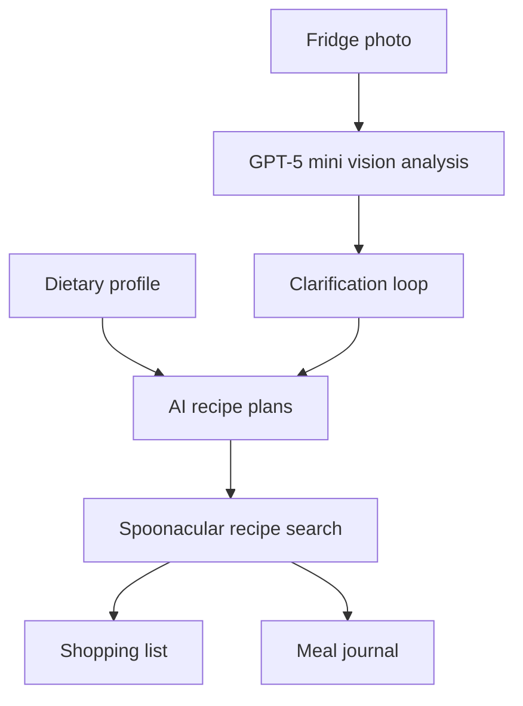

# NoWaste Chef

[](https://www.python.org/)
[](https://streamlit.io/)
[](https://github.com/poprostuadam/nowaste-chef/actions/workflows/nowaste-chef.yml)

**NoWaste Chef** is a Polish-language cooking assistant that turns a photo of available food into practical recipe suggestions. It combines OpenAI vision and structured outputs with Spoonacular recipes, a dietary profile, an automatically generated shopping list, and a local meal journal.

The project was created as part of the *Zaawansowane Metody Sztucznej Inteligencji* course.

## How it works



1. The user creates a dietary profile with body measurements, activity level, goal, and restrictions.
2. A fridge or countertop photo is uploaded to OpenAI for structured ingredient recognition.
3. If an item is ambiguous, the assistant asks follow-up questions and refines the analysis.
4. GPT‑4o creates three distinct ingredient combinations.
5. Spoonacular finds real recipes and returns instructions and nutritional data.
6. The application compares recipe ingredients with detected products and produces a shopping list.
7. A selected meal can be rated and stored in the local nutrition journal.

## Features

- ingredient recognition from fridge and countertop photos,
- confidence levels and clarification questions for uncertain products,
- automatic handling of pantry staples,
- BMR and TDEE calculations using the Mifflin–St Jeor equation,
- calorie and macronutrient targets based on activity and goal,
- dietary restrictions included in AI recipe planning,
- Spoonacular recipe search with nutrition-based filtering,
- owned and missing ingredient lists,
- meal ratings, notes, calories, and macros stored in SQLite,
- multi-page Streamlit interface,
- automated Pytest and Flake8 checks with GitHub Actions.

## Technology stack

| Area | Technology |
| --- | --- |
| Interface | Streamlit |
| Vision and planning | OpenAI Responses API, GPT‑5 mini, GPT‑4o |
| Structured output | Pydantic |
| Recipe data | Spoonacular API |
| Persistence | SQLite, SQLAlchemy |
| Tests | Pytest |
| CI | GitHub Actions |

## Quick start

### Prerequisites

- Python 3.11 or newer,
- an [OpenAI API key](https://platform.openai.com/api-keys),
- a [Spoonacular API key](https://spoonacular.com/food-api/console).

Both external APIs can incur usage costs or enforce quotas.

### 1. Clone the repository

```bash
git clone https://github.com/poprostuadam/nowaste-chef.git
cd nowaste-chef
```

### 2. Create a virtual environment

```bash
python -m venv .venv
source .venv/bin/activate
```

On Windows PowerShell:

```powershell
.venv\Scripts\Activate.ps1
```

### 3. Install dependencies

```bash
python -m pip install --upgrade pip
pip install -r requirements.txt
```

### 4. Configure API keys

```bash
cp .env.example .env
```

On Windows, copy the file manually or run:

```powershell
Copy-Item .env.example .env
```

Replace both placeholders in `.env`:

```dotenv
OPENAI_API_KEY=replace_with_your_openai_api_key
SPOONACULAR_API_KEY=replace_with_your_spoonacular_api_key
```

Never commit the completed `.env` file.

### 5. Run the application

```bash
streamlit run main/main.py
```

Streamlit will print the local application URL, normally [http://localhost:8501](http://localhost:8501).

The SQLite database `nowaste.db` is created automatically in the directory from which the application is launched.

## Application pages

| Page | Purpose |
| --- | --- |
| Start | Project introduction and navigation |
| Mój Profil | Dietary profile, calorie target, and macro calculation |
| Skaner Lodówki | Image upload, ingredient recognition, and clarification |
| Przepisy i Zakupy | AI plans, recipe results, and shopping lists |
| Dziennik Kalorii | Daily calorie summary and saved meal history |

## Project structure

```text
.
├── .github/workflows/
│   └── nowaste-chef.yml       # CI pipeline
├── main/
│   ├── example_photos/        # Sample fridge images
│   ├── tests/                 # Automated tests
│   ├── views/                 # Streamlit pages
│   ├── database.py            # SQLAlchemy models and dietary calculations
│   ├── logic.py               # OpenAI, Spoonacular, and shopping-list logic
│   ├── main.py                # Streamlit entry point
│   └── nowaste-chef.ipynb     # Experimental prototype notebook
├── pyproject.toml
├── pytest.ini
└── requirements.txt
```

## Tests

Tests mock OpenAI calls and use an in-memory SQLite database where applicable.

```bash
pytest
```

The GitHub Actions workflow runs tests and basic Flake8 checks for pushes and pull requests targeting `main`.

## Data and privacy

- Uploaded images are sent to the OpenAI API for analysis.
- Ingredient lists and profile restrictions are included in prompts used for recipe planning.
- Profile and meal-journal data are stored locally in `nowaste.db`.
- The application has no authentication and is intended as a local prototype.
- Review the privacy and retention policies of OpenAI and Spoonacular before using real personal data.
- Remove metadata and private details from test photos before sharing them.

## Limitations

- Ingredient quantities inferred from images are estimates.
- Recipe availability and nutrition data depend on Spoonacular.
- Dietary calculations are informational and are not medical or nutritional advice.
- Ingredient matching for shopping lists uses simple normalized substring comparison.
- The application currently supports one local profile and SQLite database.
- Model names and availability are configured in `main/logic.py` and may require future updates.

## Possible improvements

- delete uploaded OpenAI files after analysis,
- add authentication and multiple user profiles,
- replace substring ingredient matching with canonical ingredient identifiers,
- add request timeouts and richer API error handling,
- add a containerized deployment,
- separate runtime and development dependencies,
- optimize the large example images.

## License

This project is available under the [MIT License](LICENSE).
